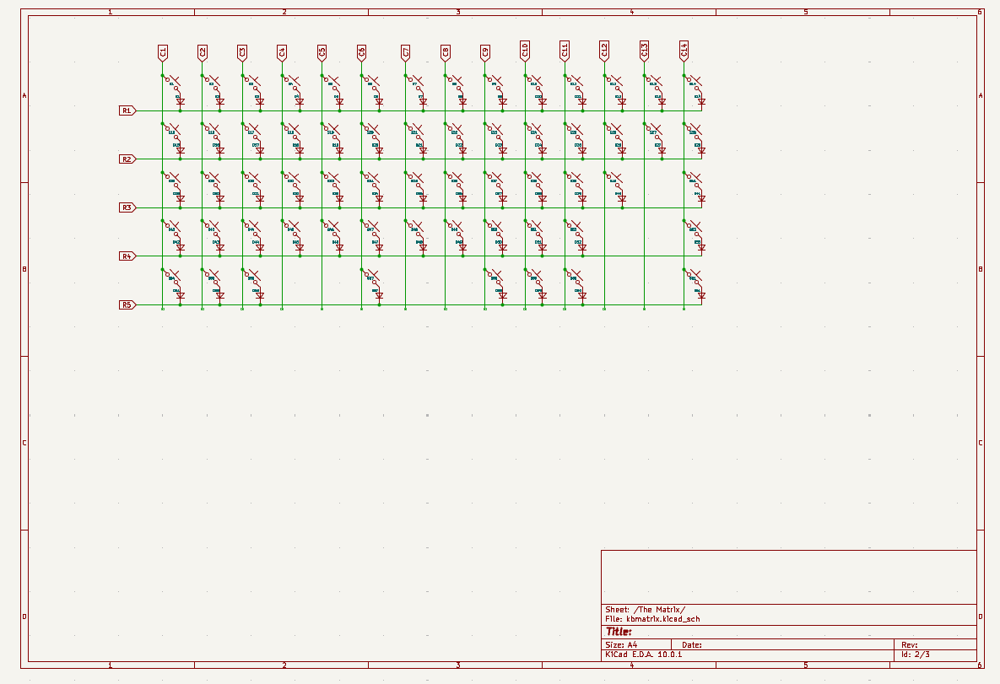

# D.VAboard
My first custom keyboard. It's kind of scuffed.
This is a 60% custom mechanical keyboard, powered by a Raspberry Pi Pico. Almost completely designed from scratch using KiCad and Autodesk Fusion. I wanted to make this project because there's a huge custom keyboard community online, which means theres tons of resources for me to draw upon. As a beginner, I really just wanted to learn the basics of KiCad and (regular) CAD while also doing a genuinely impressive and cool project. I also really like how you can personalize everything you do and make it completely your own by putting images and text on both the PCBs and the case, which is definitely a benefit of building something completely from scratch.

# Why D.VA???
I honestly don't really know, it was the first thing that came to mind since I play Overwatch a lot and she's my main. 

# Building guide
I actually haven't built this yet, but the idea is to 3D print the case, get the PCB delivered by JLC PCB, and then attatch everything together with M2 screws. The PCB would be attatched through the keyboard plate and all the electronic components would need to be soldered onto the PCB (Except the switches which should just pop on). I also haven't flashed the firmware yet because I haven't built it, so I will update when I get that done. 

# PCB front

# Case top

# Case Bottom

# Keyboard plate

# Gerber viewer

# Main schematic

# LED schematic

# Keyboard matrix schematic

# Bill of Materials

| Component | Quantity | Price (total) | Manufacturer | Purchase link |
|---|---:|---:|---|---|
| I2C OLED Display Module | 1 | $0.99 | — | [AliExpress](https://www.aliexpress.us/item/3256806179530924.html) |
| SK6812 Mini-e | 61 | $18.00 | — | [Keebio](https://keeb.io/products/sk-6812-mini-e-rgb-leds-12-pack) |
| Raspberry Pi Pico | 1 | $4.00 | — | [Mouser](https://www.mouser.com/ProductDetail/Raspberry-Pi/SC0915) |
| EC11 Rotary Encoder | 1 | $2.00 | — | [Keebio](https://keeb.io/products/rotary-encoder-ec11) |
| MX Switches | 61 | $40.00 | — | [Amazon](https://www.amazon.com/CHERRY-Silent-Mechanical-Keyboard-Switches/dp/B0FYRGWPGL/ref=sr_1_4) |
| EC11 Rotary Encoder Knob | 1 | $1.95 | — | [AliExpress](https://www.aliexpress.us/item/3256803638369929.html) |
| DO-35 Diode | 61 | $3.36 | — | [Digi-Key](https://www.digikey.com/en/products/detail/onsemi/1N4148TR/458811) |
| Rubber feet | 4 | $2.00 | — | [ScottoKeebs](https://scottokeebs.com/products/rubber-feet) |
| Keyboard PCBs | 5 | $40.91 | JLCPCB | — |
| Keycaps (60%) | 1 | $29.99 | — | [Pwnage](https://pwnage.com/products/cherry-profile-dual-shot-pbt-keycaps) |
| M2 Screws | 8 | $9.00 | — | [Amazon](https://www.amazon.com/VGBUY-Assortment-Stainless-Machine-Suitable/dp/B0FJ1XLMJT/ref=sr_1_16) |
| **Total** |  | **$152.20** |  |  |

The original spreadsheet is also available as [`BOM.csv`](BOM.csv).

