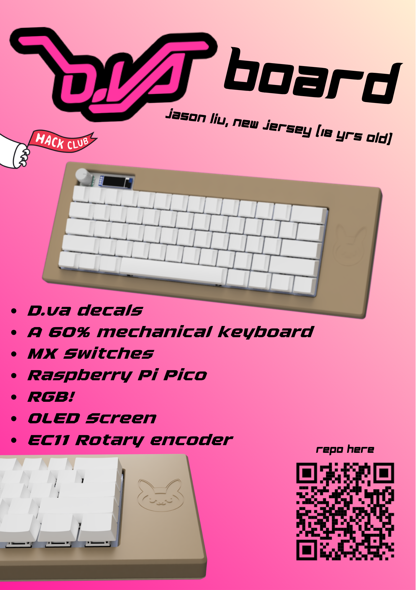
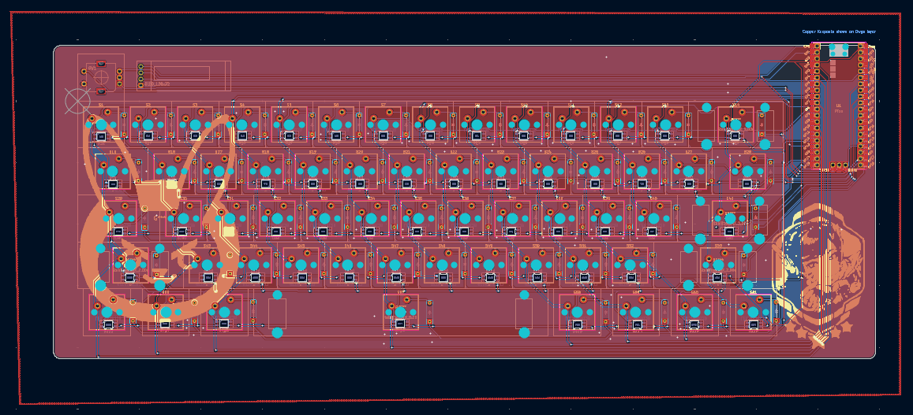
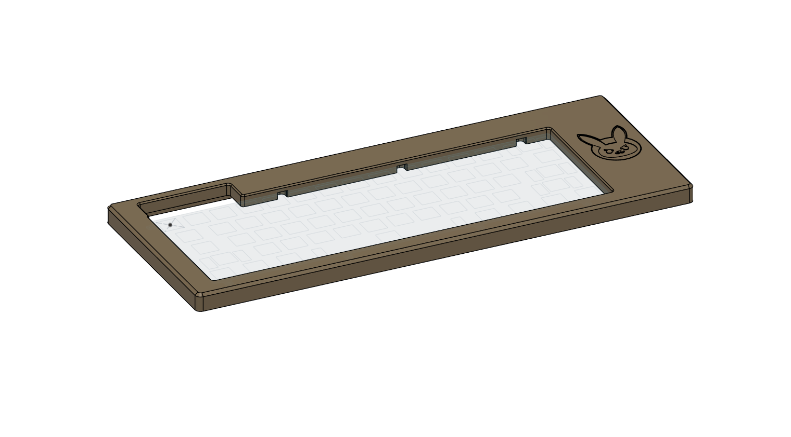
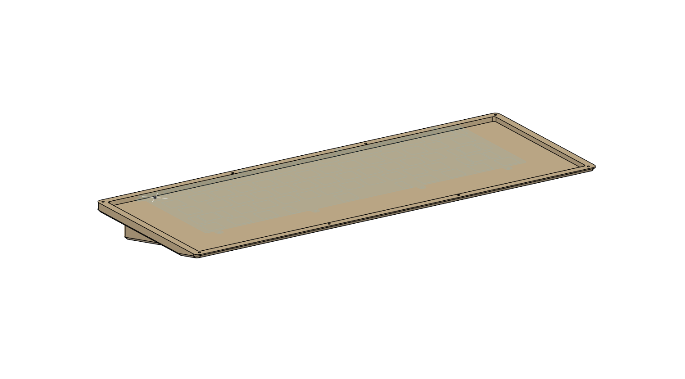
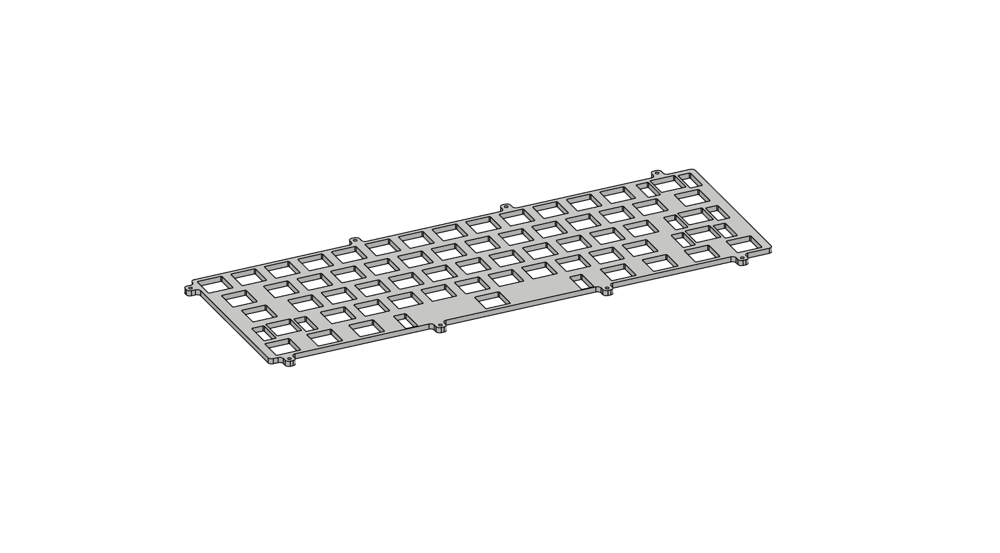
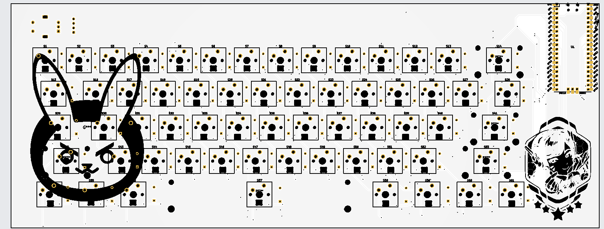
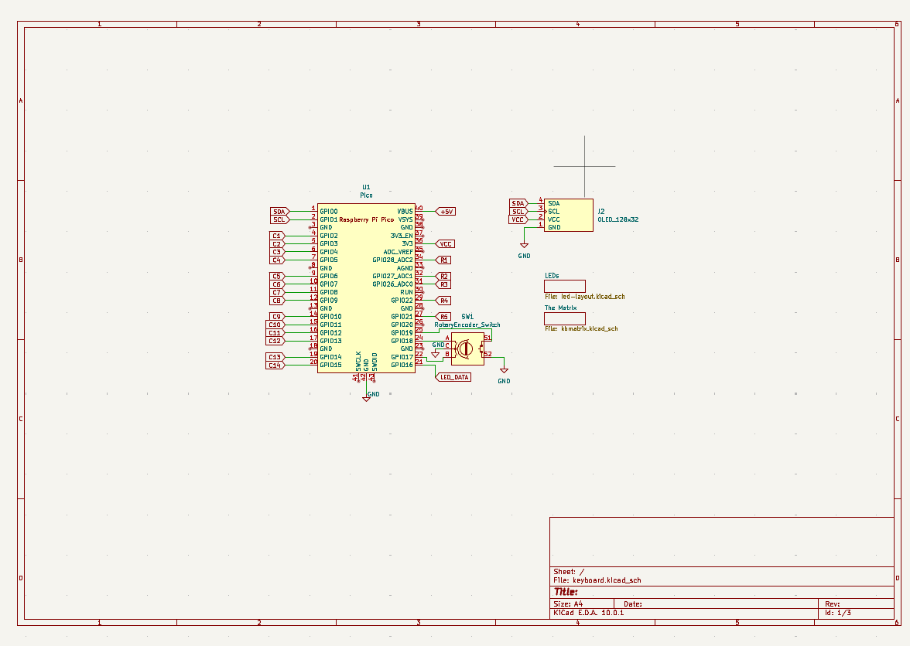
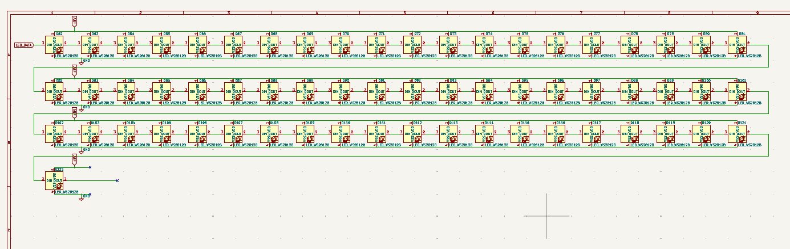

# D.VAboard
My first custom keyboard. It's kind of scuffed.
This is a 60% custom mechanical keyboard, powered by a Raspberry Pi Pico. Almost completely designed from scratch using KiCad and Autodesk Fusion. I wanted to make this project because there's a huge custom keyboard community online, which means theres tons of resources for me to draw upon. As a beginner, I really just wanted to learn the basics of KiCad and (regular) CAD while also doing a genuinely impressive and cool project. I also really like how you can personalize everything you do and make it completely your own by putting images and text on both the PCBs and the case, which is definitely a benefit of building something completely from scratch.

# Why D.VA???
I honestly don't really know, it was the first thing that came to mind since I play Overwatch a lot and she's my main. 

# PCB front

# Case top

# Case Bottom

# Keyboard plate

# Gerber viewer

# Main schematic

#LED schematic

#Keyboard matrix schematic

